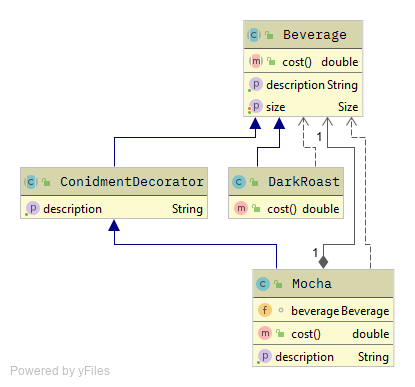

# TOC

- [Problem](#problem)

    - [시나리오](#시나리오)

    - [문제점](#문제점)

- [Solution](#solution)

    - [데코레이터 패턴의 정의](#데코레이터-패턴의-정의)

    - [UML](#uml)

#### [뒤로가기](../README.md)

<br>

# Problem

## 시나리오 

스타버즈라는 엄청난 속도로 급성장한 초대형 커피 전문점이 있고, 여러 음료들을 판매하고있다.

워낙 빠르게 성장했기 때문에, 다양한 음료들을 포괄적으로 주문하려는 시스템을 이제서야 갖추려고 하는 중이다.

```java
public abstract class Beverage {
    String description = "제목없음";

    public String getDescription() {
        return description;
    }

    public abstract double cost();
}
```

커피를 주문할 때는 스팀 우유나 두유, 모카를 추가하고, 그 위에 휘핑 크림을 얹기도 함. 이러한 것들을 추가할 때마다 커피 가격을 올리기 때문에, 주문시스템에서도 모두 고려해야함.

위와 같은 `Beverage` 추상클래스를 상속받아 각 음료별로 description을 넣어주고 cost를 구현하게 하는걸로 구상

<br>

## 문제점

`Beverage`클래스를 상속받는 클래스가 너무 많이 생겨버릴 수 있음

* EspressoBeverage, EspressoBeverageWithWhip, EspressoBeverageWithMocha ...

<br>

# Solution

## 데코레이터 패턴의 정의

```
객체에 추가적인 요건들을 동적으로 첨가한다.
서브클래스를 통해서 기능을 유연하게 확장하는 방법을 제공한다.
```

<br>

## UML



<br>