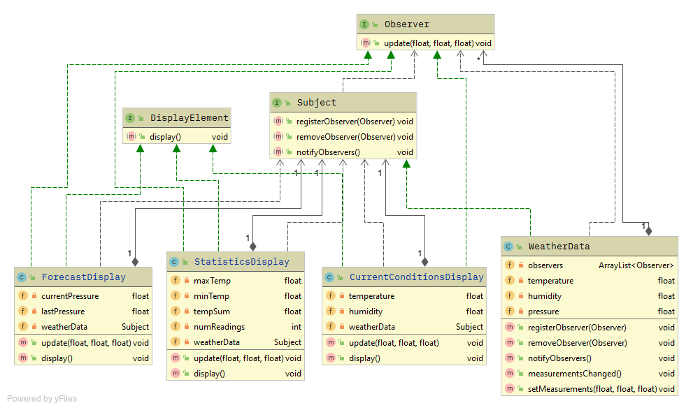

# TOC

- [Problem](#problem)

    - [시나리오](#시나리오)

    - [요약](#요약)

    - [문제점](#문제점)

- [Solution](#solution)

    - [옵저버 패턴의 정의](#옵저버-패턴의-정의)

    - [UML](#uml)

    - [느슨한 결합(Coupling)](#느슨한-결합coupling)

- [유의사항](#유의사항)

#### [뒤로가기](../README.md)

<br>

# Problem

## 시나리오

기상 스테이션이라는 시스템을 만들고자한다.  
기상청(?)에서 제공하는 데이터를 받아  
온도, 습도, 기압에 대한 데이터를 실시간으로 서로 다른 기기에 디스플레이 해주고자함

<br>

## 요약

* 기상청(?)에서 온도, 습도, 기압에 대한 데이터를 받아옴.

* 받아온 데이터를 각각 다른 기기들에 맞게 가공하여 디스플레이 함.

```java
public class WeatherData {
    float temp = getTemperature();
    float humidity = getHumidity();
    float pressure = getPressure();

    currentConditionsDisplay.update(temp, humidity, pressure);
    statisticsDisplay.update(temp, humidity, pressure);
    forecastDisplay.update(temp, humidity, pressure);
}
```

<br>

## 문제점

OCP 원칙에 어긋날 수 있는 구현이다.  
display들의 update 부분들은 구체적인 구현에 맞춰서 코딩했기 떄문에 확장에 유연하지 않음.

<br>

# Solution

## 옵저버 패턴의 정의

```
한 객체의 상태가 바뀌면 그 객체에 의존하는 다른 객체들에게 연락을 하고 자동으로 내용을 개인하는 방식으로 one-to-many 의존성을 정의함
```

<br>

## UML



<br>

## 느슨한 결합(Coupling)

* 옵저버들을 관측하는 `Subject Interface`

```java
public interface Subject {
    void registerObserver(Observer observer);
	void removeObserver(Observer observer);
	void notifyObservers();
}
```

* 각 기기들의 화면 표시에 대한 `DisplayElement Interface`

```java
public interface DisplayElement {
	void display();
}
```

* `Observer Interface`

```java
public interface Observer {
	void update(float temp, float humidity, float pressure);
}
```

>
> 이 3가지의 인터페이스를 통해서 느슨한 결합을 만든다.
> `Subject`를 구현한 클래스와 `Observer`를 구현한 클래스들 서로는 one-to-many 관계를 가지고 `composition` 될 것이고 이것이 느슨한 관계를 만들어 줄 것이다. 

<br>

# 유의사항

```
옵저버들에게 연락하는 순서에 의존한 코딩을 해서는 안됨.
순서와 상관없이 동일하게 동작되어야함.
```
